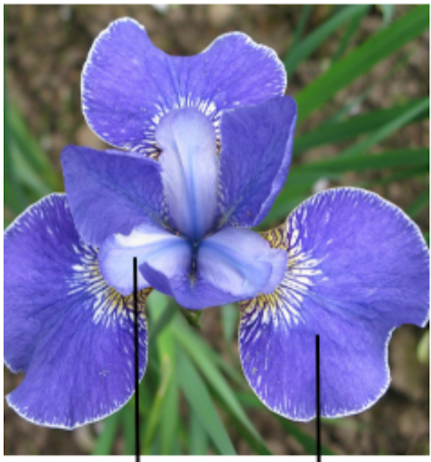

#  {visibility="hidden"}

\def\bx{\mathbf{x}}
\def\bg{\mathbf{g}}
\def\bw{\mathbf{w}}
\def\bbeta{\boldsymbol \beta}
\def\bX{\mathbf{X}}
\def\by{\mathbf{y}}
\def\bH{\mathbf{H}}
\def\bI{\mathbf{I}}
\def\bS{\mathbf{S}}
\def\bW{\mathbf{W}}
\def\T{\text{T}}
\def\cov{\mathrm{Cov}}
\def\cor{\mathrm{Corr}}
\def\var{\mathrm{Var}}
\def\E{\mathrm{E}}
\def\bmu{\boldsymbol \mu}
\DeclareMathOperator*{\argmin}{arg\,min}
\def\Trace{\text{Trace}}

```{r}
#| label: setup
#| include: false
#| eval: true
library(countdown)
library(emo)
library(knitr)
library(gt)
library(gtExtras)
library(ggplot2)
library(tidyverse)
library(tidymodels)
library(fontawesome)
library(rmarkdown)
library(reticulate)
library(lattice)
library(openintro)
library(plotly)
library(rpart)

set.seed(2026)
options(scipen = 999)
knitr::opts_chunk$set(
    fig.asp = 0.618,
    fig.align = "center",
    out.width = "100%",
    fig.retina = 10,
    fig.path = "images/19-trees/",
    message = FALSE,
    global.par = TRUE
)
options(
  htmltools.dir.version = FALSE,
  dplyr.print_min = 6,
  dplyr.print_max = 12,
  tibble.width = 150,
  width = 140,
  digits = 3
)
hook_output <- knitr::knit_hooks$get("output")
knitr::knit_hooks$set(output = function(x, options) {
  lines <- options$output.lines
  if (is.null(lines)) {
    return(hook_output(x, options))
  }
  x <- unlist(strsplit(x, "\n"))
  more <- "..."
  if (length(lines) == 1) {
    if (length(x) > lines) {
      x <- c(head(x, lines), more)
    }
  } else {
    x <- c(more, x[lines], more)
  }
  x <- paste(c(x, ""), collapse = "\n")
  hook_output(x, options)
})

theme_set(theme_minimal(base_size = 20))
```

# {background-color="#CDECCF"}  {visibility="hidden"}

::: {.left}
<h1> Decision Trees </h1>
<h2> Simple rules, visual structure, flexible predictions </h2>
:::


## Why Do We Care About Trees?

<!-- A tree predicts by **_splitting data into smaller and smaller groups_**. -->

- A **decision tree** predicts by asking a sequence of simple questions.

- Each question splits the data into smaller and more **homogeneous** groups.

- Trees can be used for both **classification** and **regression**.

. . .

:::: {.columns}

::: {.column width="33%"}
### Email

Contains many links?  
→ Yes

Contains suspicious words?  
→ Yes

**Classify as: Spam**

```{r}
#| echo: false
#| out-width: 55%

```

:::

::: {.column width="33%"}

::: fragment

### Loans

Income high enough?  
→ Yes

Debt too large?  
→ No

**Classify as: Approve**

```{r}
#| echo: false
#| out-width: 55%

```

:::

:::

::: {.column width="33%"}

::: fragment

### Biology

Petal length < 2.5 cm?  
→ Yes

Petal width < 1 cm?  
→ Yes

**Classify as: Setosa**

```{r}
#| echo: false
#| out-width: 50%

```

:::

:::


::::


## The Main Idea


:::{.center}
[_Instead of fitting one single equation, a tree repeatedly splits the **predictor** space into regions._]{.green}
:::

:::: {.columns}

::: {.column width="50%"}

- Start with all training data at the **root**.
- Ask a question such as `Petal.Length < 2.5?`
- Split the data into two child nodes.
- Keep splitting until the groups are simple enough.
- At the end, each **leaf** makes a prediction.

- **Root node**: the first split
- **Internal node**: a question
- **Leaf (terminal) node**: the final prediction
<!-- - **Path**: the sequence of questions followed by one observation -->

:::


::: {.column width="50%"}
<!-- ## A Toy Tree -->

```{mermaid}
%%| echo: false
%%{init: {'theme':'base', 'themeVariables': { 'fontSize': '24px'}}}%%
graph TD
    A[An iris] --> B{Petal length < 2.5?}
    B -- Yes --> C[Predict setosa]
    B -- No --> D{Petal width < 1.7?}
    D -- Yes --> E[Predict versicolor]
    D -- No --> F[Predict virginica]

    classDef start fill:#E3F2FD,stroke:#1E88E5,stroke-width:2px,color:#0D47A1,font-size:24px;
    classDef question fill:#FFF3E0,stroke:#FB8C00,stroke-width:2px,color:#E65100,font-size:24px;
    classDef setosa fill:#E8F5E9,stroke:#43A047,stroke-width:2px,color:#1B5E20,font-size:24px;
    classDef versicolor fill:#F3E5F5,stroke:#8E24AA,stroke-width:2px,color:#4A148C,font-size:24px;
    classDef virginica fill:#FCE4EC,stroke:#D81B60,stroke-width:2px,color:#880E4F,font-size:24px;

    class A start;
    class B,D question;
    class C setosa;
    class E versicolor;
    class F virginica;
    
```


:::

::::


## Trees Split the Predictor Space


:::: {.columns}

::: {.column width="40%"}
<!-- ## A Toy Tree -->

```{mermaid}
%%| echo: false
%%{init: {'theme':'base', 'themeVariables': { 'fontSize': '24px'}}}%%
graph TD
    A[An iris] --> B{Petal length < 2.5?}
    B -- Yes --> C[Predict setosa]
    B -- No --> D{Petal width < 1.7?}
    D -- Yes --> E[Predict versicolor]
    D -- No --> F[Predict virginica]

    classDef start fill:#E3F2FD,stroke:#1E88E5,stroke-width:2px,color:#0D47A1,font-size:24px;
    classDef question fill:#FFF3E0,stroke:#FB8C00,stroke-width:2px,color:#E65100,font-size:24px;
    classDef setosa fill:#E8F5E9,stroke:#43A047,stroke-width:2px,color:#1B5E20,font-size:24px;
    classDef versicolor fill:#F3E5F5,stroke:#8E24AA,stroke-width:2px,color:#4A148C,font-size:24px;
    classDef virginica fill:#FCE4EC,stroke:#D81B60,stroke-width:2px,color:#880E4F,font-size:24px;

    class A start;
    class B,D question;
    class C setosa;
    class E versicolor;
    class F virginica;
    
```


:::


::: {.column width="60%"}

- A tree usually makes **axis parallel splits**.
- In two predictors, these splits create rectangles.
- Every rectangle corresponds to one leaf.

```{r}
#| echo: false
#| fig-asp: 0.75
#| out-width: 100%
iris_tbl <- as_tibble(iris) |>
  select(Petal.Length, Petal.Width, Species)

ggplot(iris_tbl, aes(Petal.Length, Petal.Width, color = Species)) +
  geom_point(size = 3, alpha = 0.8) +
  geom_vline(xintercept = 2.5, linetype = 2, linewidth = 1) +
  annotate(
    "segment",
    x = 2.5, xend = max(iris_tbl$Petal.Length),
    y = 1.7, yend = 1.7,
    linetype = 2, linewidth = 1
  ) +
  annotate("text", x = 1.8, y = 1.3, label = "Region 1", size = 7) +
  annotate("text", x = 5.2, y = 0.5, label = "Region 2", size = 7) +
  annotate("text", x = 3.8, y = 2.3, label = "Region 3", size = 7) +
  labs(
    title = "Decision trees create rectangular regions",
    x = "Petal Length",
    y = "Petal Width"
  ) +
  theme(legend.position = "bottom")
```

:::

::::

. . .


## How Does the Tree Choose a Split?

For a classification tree, the goal is to create **purer** groups.

. . .

A common **impurity** measure is the **Gini index**:

$$
\text{Gini} = 1 - \sum_{k=1}^{K} p_k^2,
$$

where $p_k$ is the proportion of class $k$ inside a node.

. . .

- If a node is all one class, Gini = 0.
- If a node is a mixture of classes, Gini is larger.
- The tree searches over many candidate questions and picks the split that most reduces impurity.


## Gini Intuition

:::: {.columns}

::: {.column width="50%"}
**Almost pure leaf**

- 9 setosa
- 1 versicolor
- 0 virginica

$$
\text{Gini} = 1 - (0.9^2 + 0.1^2 + 0^2) = 0.18
$$
:::

::: {.column width="50%"}
**Mixed leaf**

- 4 setosa
- 3 versicolor
- 3 virginica

$$
\text{Gini} = 1 - (0.4^2 + 0.3^2 + 0.3^2) = 0.66
$$
:::

::::

. . .

:::{.center}
[*Smaller Gini means a cleaner, easier to classify node.*]{.green}
:::


## How Does Prediction Work?

:::: {.columns}

::: {.column width="60%"}
To classify a new observation:

1. Start at the root.
2. Check the first rule.
3. Move left or right.
4. Continue until you reach a leaf.
5. Predict the majority class in that leaf.

::: fragment

A leaf can also report estimated class probabilities.

Example:

- Leaf contains 18 versicolor and 2 virginica.
- Predicted class = `versicolor`
- Estimated probabilities: 0.90 and 0.10

:::

:::

::: {.column width="40%"}
<!-- ## A Toy Tree -->

```{mermaid}
%%| echo: false
%%{init: {'theme':'base', 'themeVariables': { 'fontSize': '24px'}}}%%
graph TD
    A[NEW iris] --> B{Petal length < 2.5?}
    B -- Yes --> C[Predict setosa]
    B -- No --> D{Petal width < 1.7?}
    D -- Yes --> E[Predict versicolor]
    D -- No --> F[Predict virginica]

    classDef start fill:#E3F2FD,stroke:#1E88E5,stroke-width:2px,color:#0D47A1,font-size:24px;
    classDef question fill:#FFF3E0,stroke:#FB8C00,stroke-width:2px,color:#E65100,font-size:24px;
    classDef setosa fill:#E8F5E9,stroke:#43A047,stroke-width:2px,color:#1B5E20,font-size:24px;
    classDef versicolor fill:#F3E5F5,stroke:#8E24AA,stroke-width:2px,color:#4A148C,font-size:24px;
    classDef virginica fill:#FCE4EC,stroke:#D81B60,stroke-width:2px,color:#880E4F,font-size:24px;

    class A start;
    class B,D question;
    class C setosa;
    class E versicolor;
    class F virginica;
    
```

:::

::::


## Classification Trees vs. Regression Trees {visibility="hidden"}

:::: {.columns}

::: {.column width="50%"}
**Classification tree**

- response is categorical
- each leaf predicts a class
- impurity often measured by Gini or entropy
:::

::: {.column width="50%"}
**Regression tree**

- response is numerical
- each leaf predicts an average
- split quality often measured by reduction in squared error
:::

::::

. . .

The structure is the same. Only the prediction target changes.


## Why Are Trees Popular?

:::: {.columns}

::: {.column width="50%"}

- Very interpretable
- Handle nonlinear relationships naturally
- Capture interactions automatically
- Need little preprocessing
- Work with numerical and categorical predictors

::: fragment

But they also have weaknesses:

- can overfit
- can be unstable
- one small data change can change the tree a lot
- axis parallel splits can be too rigid

:::

:::

::: {.column width="50%"}

```{r}
#| echo: false
#| fig-asp: 0.75
#| out-width: 100%
iris_tbl <- as_tibble(iris) |>
  select(Petal.Length, Petal.Width, Species)

ggplot(iris_tbl, aes(Petal.Length, Petal.Width, color = Species)) +
  geom_point(size = 3, alpha = 0.8) +
  geom_vline(xintercept = 2.5, linetype = 2, linewidth = 1) +
  annotate(
    "segment",
    x = 2.5, xend = max(iris_tbl$Petal.Length),
    y = 1.7, yend = 1.7,
    linetype = 2, linewidth = 1
  ) +
  annotate("text", x = 1.8, y = 1.3, label = "Region 1", size = 7) +
  annotate("text", x = 5.2, y = 0.5, label = "Region 2", size = 7) +
  annotate("text", x = 3.8, y = 2.3, label = "Region 3", size = 7) +
  labs(
    title = "Decision trees create rectangular regions",
    x = "Petal Length",
    y = "Petal Width"
  ) +
  theme(legend.position = "bottom")
```

:::
::::

## Overfitting and Pruning

A very deep tree can memorize the training data.

. . .

Common controls:

- `tree_depth`: limit how deep the tree can grow
- `min_n`: require enough observations before a split
- `cost_complexity`: penalize unnecessary splits

. . .

:::{.center}
[*A shallow tree is often easier to explain and generalizes better.*]{.green}
:::


# {background-color="#A7D5E8" background-image="https://raw.githubusercontent.com/rstudio/hex-stickers/master/PNG/parsnip.png" background-size="28%" background-position="90% 50%"} {visibility="hidden"}

::: {.left}
<h1> A Basic Example in R </h1>
<h2> iris species from petal measurements </h2>
:::


## Load and Prepare Data

```{r}
#| code-line-numbers: false
iris_tree <- as_tibble(iris) |>
  select(Species, Petal.Length, Petal.Width) |>
  mutate(Species = as.factor(Species))

iris_tree
```

<!-- . . . -->

<!-- We will use only two predictors so the tree is easy to read. -->


## Training and Test Data

```{r}
#| code-line-numbers: false
set.seed(2026)
iris_split <- initial_split(iris_tree, prop = 0.8, strata = Species)
train_tbl <- training(iris_split)
test_tbl  <- testing(iris_split)

dim(train_tbl)
dim(test_tbl)
```


## Recipe and Model {visibility="hidden"}

```{r}
#| code-line-numbers: false
tree_recipe <- recipe(Species ~ Petal.Length + Petal.Width, data = train_tbl)

tree_spec <- decision_tree(
  mode = "classification",
  tree_depth = 2,
  cost_complexity = 0.001
) |>
  set_engine("rpart")
```

. . .

- `tree_depth = 2` keeps the tree simple.
- `cost_complexity` discourages unnecessary splits.


## Fit the Tree


:::: {.columns}

::: {.column width="35%"}

::: midi

```{r}
#| code-line-numbers: false
#| classes: my_class600
#| class-source: my_class600

# recipe
tree_recipe <- 
  recipe(
    Species ~ Petal.Length + Petal.Width, 
    data = train_tbl)

# model
tree_spec <- decision_tree(
  mode = "classification",
  tree_depth = 2,
  cost_complexity = 0.001) |>
  set_engine("rpart")

# workflow and fit
tree_fit <- workflow() |>
  add_recipe(tree_recipe) |>
  add_model(tree_spec) |>
  fit(data = train_tbl)
```

:::

- `tree_depth = 2` keeps the tree simple.
- `cost_complexity` discourages unnecessary splits.

:::


<!-- :::: {.columns} -->

::: {.column width="65%"}

::: middle

```{r}
#| echo: false
#| classes: my_classfull
#| class-output: my_classfull
tree_fit
```

:::

:::

::::

## Visualize the Fitted Tree

Read the tree from top to bottom. Every split is a yes or no question.

```{r}
#| echo: false
#| fig-asp: 0.75
#| fig-width: 6
par(mar = c(1, 1, 1, 1)*0)
# plot(extract_fit_engine(tree_fit), uniform = TRUE, margin = 0.1)
# text(extract_fit_engine(tree_fit), use.n = TRUE, all = TRUE, cex = 1)
library(rpart.plot)
rpart.plot(
  extract_fit_engine(tree_fit),
  digits = 0,
  roundint = FALSE,
  extra = 101
)
```


## Prediction on the Test Data

<!-- :::: {.columns} -->

<!-- ::: {.column width="55%"} -->

::: middle

```{r}
#| code-line-numbers: false
pred_tbl <- bind_cols(test_tbl, predict(tree_fit, test_tbl),
                      predict(tree_fit, test_tbl, type = "prob"))
pred_tbl[sample(1:30, 5), ] |> select(-c("Petal.Length", "Petal.Width"))
```


<!-- ::: -->

<!-- ::: {.column width="45%"} -->

::: fragment

```{r}
#| code-line-numbers: false
tree_pred <- predict(tree_fit, test_tbl) |> pull(.pred_class)
table(truth = test_tbl$Species, pred = tree_pred)
mean(tree_pred == test_tbl$Species)
```

:::

:::

<!-- ::: -->

<!-- :::: -->

::: notes
- The fitted tree gives explicit rules.
- The rules are easy to explain to another person.
- The model is nonlinear without writing a complicated equation.
- Tree tuning matters because a tree can be too shallow or too deep.
- Decision trees are rule based models.
- They are interpretable and flexible.
- They work for both classification and regression.
- They can overfit, so tuning and pruning matter.
- They are a natural bridge to random forests and boosting later.
:::


## What Should Students Notice? {visibility="hidden"}

- The fitted tree gives explicit rules.
- The rules are easy to explain to another person.
- The model is nonlinear without writing a complicated equation.
- Tree tuning matters because a tree can be too shallow or too deep.


# {background-color="#ffde57" background-image="https://upload.wikimedia.org/wikipedia/commons/0/05/Scikit_learn_logo_small.svg" background-size="40%" background-position="90% 50%"}

::: {.left}
<!-- <h1> A Basic Example in Python </h1> -->
<!-- <h2> sklearn.tree.DecisionTreeClassifier </h2> -->
<h1> sklearn.tree.DecisionTreeClassifier </h1>
:::


## Load Packages and Data

```{python}
#| eval: true
#| code-line-numbers: false
import pandas as pd
import matplotlib.pyplot as plt
from sklearn.datasets import load_iris
from sklearn.model_selection import train_test_split
from sklearn.tree import DecisionTreeClassifier, plot_tree
from sklearn.metrics import confusion_matrix, accuracy_score
# Load the iris dataset as pandas objects
iris = load_iris(as_frame=True)
print(iris.frame.head(3))
# Choose two predictor variables
X = iris.frame[["petal length (cm)", "petal width (cm)"]]
# Choose the response variable: flower species
y = iris.target
```

::: notes
With as_frame=True, scikit-learn returns the data in pandas form, so the predictors are available as a DataFrame and the target is available as a pandas Series or DataFrame rather than only as NumPy arrays. The returned object is a Bunch, which is a dictionary-like container holding pieces such as the data, target, feature names, and target names.

A good way to picture iris is:

iris.frame = the full table

iris.data = predictor columns only

iris.target = response variable coded as numbers

iris.target_names = species names corresponding to those numbers
:::

## Training and Fitting

```{python}
#| eval: true
#| code-line-numbers: false
X_trn, X_tst, y_trn, y_tst = train_test_split(X, y, test_size=0.2, 
                                              random_state=2026, stratify=y)
tree = DecisionTreeClassifier(max_depth=2, ccp_alpha=0.001, random_state=2026)
tree.fit(X_trn, y_trn)
```

::: notes
In scikit-learn, ccp_alpha is defined as the complexity parameter for Minimal Cost-Complexity Pruning, and the chosen subtree is the largest one with cost complexity smaller than ccp_alpha. In rpart, cp is the complexity parameter used to trim or prune the tree. These are very closely related CART-style pruning controls, but because the implementations are in different libraries, you should not assume that 0.001 in scikit-learn and 0.001 in rpart will always give exactly the same final tree.
:::


## Visualize the Tree

::: {.panel-tabset}

## Tree

```{python}
#| eval: true
#| echo: false
#| code-line-numbers: false
#| out-width: 80%
plt.figure(figsize=(12, 7))
plot_tree(
    tree,
    feature_names=X.columns,
    class_names=iris.target_names,
    filled=True
)
plt.tight_layout()
plt.show()
```


## Code

```{python}
#| eval: false
#| code-line-numbers: false
plot_tree(
    tree,
    feature_names=X.columns,
    class_names=iris.target_names,
    filled=True
)
plt.show()
```

:::


## Prediction and Accuracy

```{python}
#| eval: true
#| code-line-numbers: false
y_pred = tree.predict(X_tst)
confusion_matrix(y_tst, y_pred)
```

. . .

```{python}
#| eval: true
#| code-line-numbers: false
accuracy_score(y_tst, y_pred)
```


## R Code {visibility="hidden"}

::: midi

```{r}
#| eval: false
#| class-source: my_classfull
library(tidymodels)
library(rpart)

iris_tree <- as_tibble(iris) |>
  select(Species, Petal.Length, Petal.Width) |>
  mutate(Species = as.factor(Species))

set.seed(2026)
iris_split <- initial_split(iris_tree, prop = 0.8, strata = Species)
train_tbl <- training(iris_split)
test_tbl  <- testing(iris_split)

tree_recipe <- recipe(Species ~ Petal.Length + Petal.Width, data = train_tbl)

tree_spec <- decision_tree(
  mode = "classification",
  tree_depth = 2,
  cost_complexity = 0.001
) |>
  set_engine("rpart")

tree_fit <- workflow() |>
  add_recipe(tree_recipe) |>
  add_model(tree_spec) |>
  fit(data = train_tbl)

plot(extract_fit_engine(tree_fit), uniform = TRUE, margin = 0.1)
text(extract_fit_engine(tree_fit), use.n = TRUE, all = TRUE, cex = 1)

tree_pred <- predict(tree_fit, test_tbl) |>
  pull(.pred_class)

table(truth = test_tbl$Species, pred = tree_pred)
mean(tree_pred == test_tbl$Species)
```

:::


## Python Code {visibility="hidden"}

::: midi

```{python}
#| eval: false
import pandas as pd
import matplotlib.pyplot as plt
from sklearn.datasets import load_iris
from sklearn.model_selection import train_test_split
from sklearn.tree import DecisionTreeClassifier, plot_tree
from sklearn.metrics import confusion_matrix, accuracy_score

iris = load_iris(as_frame=True)
X = iris.frame[["petal length (cm)", "petal width (cm)"]]
y = iris.target

X_trn, X_tst, y_trn, y_tst = train_test_split(
    X, y, test_size=0.2, random_state=2026, stratify=y
)

tree = DecisionTreeClassifier(max_depth=2, ccp_alpha=0.001, random_state=2026)
tree.fit(X_trn, y_trn)

plt.figure(figsize=(12, 7))
plot_tree(
    tree,
    feature_names=X.columns,
    class_names=iris.target_names,
    filled=True
)
plt.show()

y_pred = tree.predict(X_tst)
confusion_matrix(y_tst, y_pred)
accuracy_score(y_tst, y_pred)
```

:::


## Takeaway {visibility="hidden"}

- Decision trees are rule based models.
- They are interpretable and flexible.
- They work for both classification and regression.
- They can overfit, so tuning and pruning matter.
- They are a natural bridge to random forests and boosting later.
